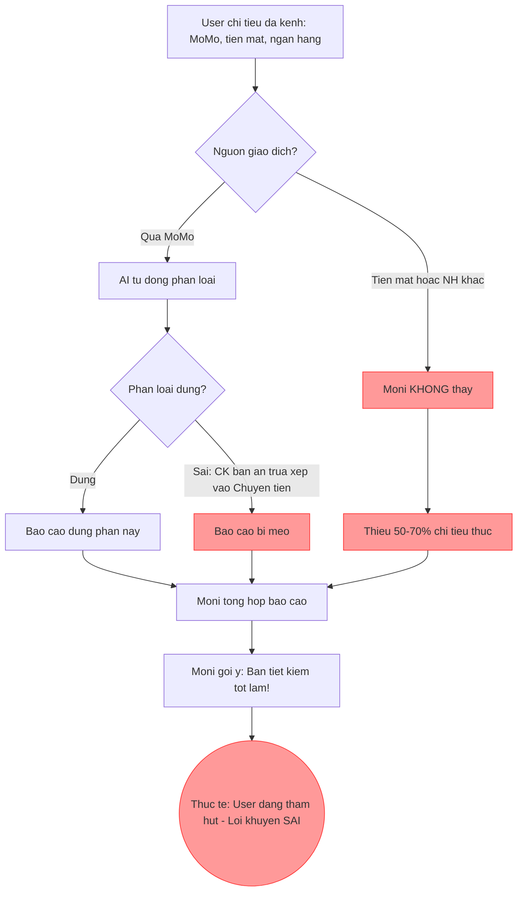
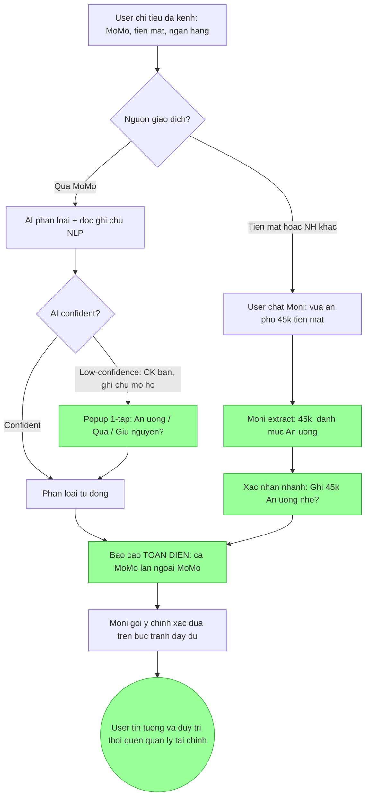

# Workshop — Mổ App AI Thật: MoMo - Moni

**Người thực hiện:** Nguyễn Dương Hiếu - 2A20260084
**Sản phẩm:** MoMo — Moni (Trợ thủ tài chính AI — Quản lý chi tiêu tự động)

## 1. Chọn sản phẩm để dùng thử

| Sản phẩm | AI feature | Cách truy cập |
|---|---|---|
| MoMo — Moni | Tự động phân loại giao dịch, báo cáo chi tiêu, đặt hạn mức ngân sách, gợi ý tài chính cá nhân hóa | App MoMo → Quản lý chi tiêu |

## 2. Dùng thử: Promise vs Reality

**Ghi nhận nhanh:**
- **Product hứa gì?** Moni hứa là "quản gia tài chính cá nhân" — tự động ghi nhận mọi khoản chi, phân loại thông minh (Ăn uống, Di chuyển, Mua sắm...), đưa báo cáo trực quan để user biết "tiền đã đi đâu", và cảnh báo khi chi tiêu vượt hạn mức.
- **User nào được hứa sẽ được giúp?** Người trẻ (Gen Z, Millennials) bận rộn, muốn kiểm soát tài chính cá nhân nhưng lười ghi chép thủ công.
- **Bạn kỳ vọng AI làm được task nào?** Tự động nhận diện đúng danh mục cho mọi giao dịch, và tổng hợp được bức tranh tài chính toàn diện (bao gồm cả tiền mặt, giao dịch ngân hàng khác) để gợi ý có ý nghĩa.
- **Khi dùng thật, điểm gãy xuất hiện ở đâu?** Hai vấn đề lớn: (1) AI phân loại sai danh mục — chuyển tiền cho bạn ăn trưa bị xếp vào "Chuyển tiền" thay vì "Ăn uống", khiến báo cáo méo mó. (2) Moni chỉ "nhìn thấy" giao dịch qua MoMo, hoàn toàn mù với chi tiêu tiền mặt và giao dịch ngân hàng khác — dẫn đến báo cáo thiếu 50-70% chi tiêu thực tế, lời khuyên AI trở nên vô nghĩa.

**Evidence:**
- **Prompt/input đã thử:** Thực hiện chuỗi giao dịch trong 1 tuần: chuyển tiền bạn ăn trưa (ghi chú "Tiền cơm trưa"), thanh toán Grab, mua cafe bằng QR, trả tiền trọ bằng chuyển khoản ngân hàng (ngoài MoMo), và mua đồ ăn vặt bằng tiền mặt.
- **Hành vi quan sát được:**
  1. Giao dịch chuyển 75.000đ cho bạn kèm ghi chú "Tiền cơm trưa" → AI xếp vào danh mục **"Chuyển tiền"** thay vì **"Ăn uống"**. Dù đã có ghi chú rõ ràng, AI vẫn ưu tiên loại giao dịch (transfer) hơn ngữ nghĩa nội dung.
  2. Báo cáo tuần hiện tổng chi tiêu 650.000đ. Nhưng thực tế user đã chi thêm ~1.200.000đ tiền mặt (trọ, ăn vặt, gửi xe) mà Moni không biết → **Báo cáo chỉ phản ánh ~35% chi tiêu thực**.
  3. Moni gợi ý: *"Bạn đang chi tiêu rất tốt, tiết kiệm hơn tháng trước 20%!"* → Thực tế user đang thâm hụt nặng vì tiền mặt chi nhiều nhưng Moni không thấy. **Lời khen vô tình trở thành lời khuyên sai lệch nguy hiểm.**
  4. Tính năng "Thêm giao dịch ngoài" có tồn tại nhưng bị giấu sâu trong UI, yêu cầu nhập tay từng khoản → đi ngược lại promise "tự động, không cần ghi chép thủ công".

## 3. Vẽ 4 paths

| Path | Câu hỏi cần trả lời & Phân tích |
|---|---|
| **Happy** | **Khi AI đúng và tự tin, user thấy gì?** Khi user thanh toán QR tại cửa hàng có tên rõ ràng (VinMart, Circle K), AI phân loại đúng "Mua sắm" hoặc "Ăn uống". Báo cáo chính xác, biểu đồ tròn trực quan. User cảm thấy nắm được dòng tiền. |
| **Low-confidence** | **Khi AI không chắc, hệ thống có hỏi lại, show options không?** *Thực tế:* Không. AI tự tin phân loại mọi giao dịch mà không bao giờ hỏi user. Chuyển khoản 500k cho bạn ghi chú "góp tiền sinh nhật" bị xếp thẳng vào "Chuyển tiền" — đáng lẽ AI nên hỏi: *"Khoản này thuộc Quà tặng, Giải trí, hay Chuyển tiền?"* |
| **Failure** | **Khi AI sai, user biết bằng cách nào và sửa thế nào?** User chỉ phát hiện khi mở báo cáo cuối tháng, thấy mục "Ăn uống" thấp bất thường còn "Chuyển tiền" cao bất thường. Phải vào **Sổ giao dịch → bấm từng dòng → đổi danh mục thủ công**. Với 50+ giao dịch/tháng, việc này cực kỳ mệt mỏi. |
| **Correction** | **Khi user sửa, correction có được lưu/log/học lại không?** MoMo claim rằng AI sẽ "ghi nhớ" và áp dụng cho lần sau. Tuy nhiên, trong thực tế test, sau khi sửa "Chuyển tiền" → "Ăn uống" cho giao dịch chuyển khoản bạn ăn trưa lần 1, lần chuyển khoản tiếp theo cho cùng người vẫn bị xếp lại vào "Chuyển tiền". Vòng lặp sửa → sai lại → sửa lại khiến user bỏ cuộc. |

## 4. Viết finding thành quyết định

> Khi user **thanh toán hoặc chuyển khoản qua MoMo cho các chi tiêu hàng ngày (ăn uống, góp tiền, quà tặng) và đồng thời có nhiều khoản chi tiền mặt/ngân hàng khác ngoài MoMo**,
> AI/product **phân loại sai danh mục giao dịch (ưu tiên loại giao dịch hơn ngữ nghĩa ghi chú) và hoàn toàn bỏ qua 50-70% chi tiêu thực ngoài hệ sinh thái MoMo**.
> Hậu quả là **báo cáo tài chính bị méo mó nghiêm trọng, lời gợi ý AI trở nên sai lệch và nguy hiểm (khen user tiết kiệm trong khi thực tế đang thâm hụt), khiến user mất hoàn toàn niềm tin vào "quản gia tài chính" và ngừng sử dụng tính năng**.
> Lỗi thuộc layer **Data (thiếu dữ liệu chi tiêu ngoài app) + Intent/NLP (phân loại danh mục không dựa vào ngữ nghĩa ghi chú) + UX Recovery (sửa sai quá cực nhọc, AI không học được)**.
> Nên sửa bằng **Hai thay đổi song song:**
> 1. **Smart Categorization với NLP ghi chú:** Khi phát hiện giao dịch "Chuyển tiền" có ghi chú chứa keyword liên quan ăn uống/quà/thuê nhà, AI phải trigger luồng low-confidence — hiển thị popup nhẹ: *"Khoản 75k cho Minh có phải chi tiêu Ăn uống không?"* kèm 3 nút nhanh `[Ăn uống]` `[Quà tặng]` `[Giữ nguyên Chuyển tiền]`. Chỉ cần 1 tap thay vì 4-5 bước sửa tay.
> 2. **Quick-log tiền mặt bằng Chat:** Cho phép user nhắn nhanh cho Moni: *"vừa ăn phở 45k tiền mặt"* → AI tự tạo giao dịch ngoài, gán đúng danh mục "Ăn uống", 45.000đ. Biến Moni chatbot thành cổng nhập liệu tự nhiên thay vì form cứng nhắc.

## 5. Sketch as-is / to-be

### AS-IS (Hiện tại — Điểm gãy):

### TO-BE (Đề xuất sửa):

## 6. Tự kiểm trước khi nộp

- [x] Có ít nhất 1 screenshot hoặc observation cụ thể (Đã có 4 observation chi tiết từ 1 tuần self-use thực tế).
- [x] Có đủ 4 paths hoặc nói rõ path nào chưa có trong product (Đã phân tích cả 4, chỉ rõ Low-confidence path hoàn toàn thiếu vắng).
- [x] Finding được viết thành product decision, không chỉ là nhận xét (Đã viết theo format: trigger → failure → impact → layer → fix, kèm 2 giải pháp cụ thể).
- [x] Sketch có as-is và to-be (Đã vẽ Mermaid flowchart, đánh dấu đỏ điểm gãy + xanh điểm sửa).
- [x] Có một câu nói rõ finding này sẽ đổi gì trong SPEC (Đổi SPEC: thêm NLP-based smart categorization với popup 1-tap cho low-confidence, và thêm quick-log qua chat Moni cho giao dịch ngoài app).
